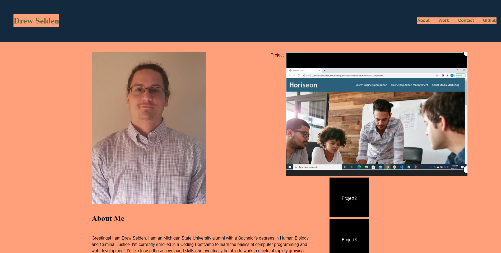

# Portfolio
## Description
- For this project I was tasked with creating a portfolio for myself that when viewed provided a good sampling of my past work/projects in order to asses whether I would be a good candidate for an open job position. The deployed portfolio needed to have the developer's name, a recent photo, and links to sections about them, their work, and how to contact them. The site also needed to have nav bar functionality, titled images of their work/applications and the first application image should be larger in size than the others, and that when you click on the images of the applications you are taken to that deployed application. Finally it needed viewport adaptability that will respond to various screens and devices.

- I built the porfolio with a basic webpage layout that included a header with a nav bar with links that make the ui jump to the corresponding section by adding ID tags to them. A body with sections that includes the titled images for my past work/projects as well as on click functionality to view the deployed applications after clicking. The last thing was to add flexbox functionality by adding display: flex; in the <main> section so that it was able to be viewed by various screen sizes and devices.

- I learned that CSS is very tricky and you can spend a lot of time trying to move one thing to a specific spot. I had a lot of trouble trying to get images where and how I wanted them and even more trouble making them do what I wanted when I would scale the viewport down to tablet or phone size.

- It seems there is so much more I could of done styling wise to really make this portfolio page appealing but I think it will only get better as I learn new skills and various tips and tricks to help solve little issues that end up causing big problems when you scale the view port down to tablet or phone size.

## Usage

 

